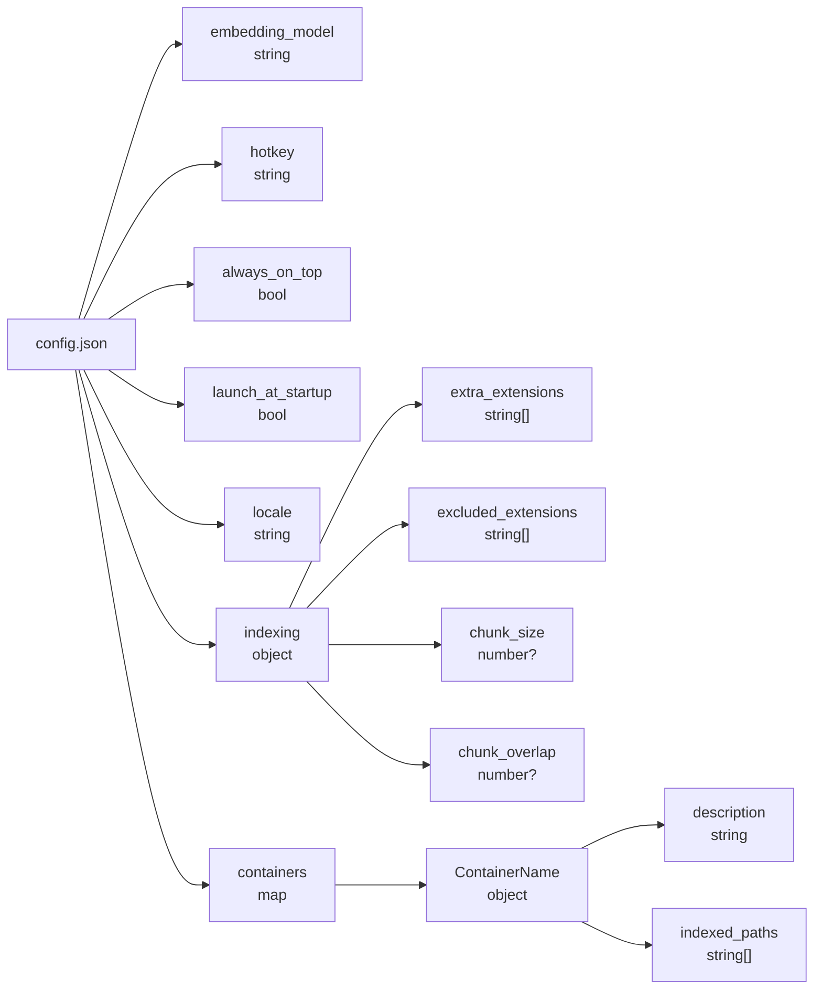

# Configuration

`%AppData%\com.recall-lite.app\config.json`

Created on first launch with safe defaults. Hand-editable. If the JSON is malformed, the app resets to defaults and migrates what it can recover.

---

## Structure



---

## Schema validation

Add this field for autocomplete and inline validation in VS Code and other JSON-aware editors:

```json
{
  "$schema": "https://raw.githubusercontent.com/FeelTheFonk/recall-lite/main/config.schema.json"
}
```

The schema lives at [`config.schema.json`](config.schema.json) in the repo root.

---

## Embedding model

```json
{
  "embedding_model": "MultilingualE5Base"
}
```

| Value | Dimensions | Disk | Notes |
|---|---|---|---|
| `MultilingualE5Base` | 768 | ~1.1 GB | Default. Best quality. Multilingual. |
| `MultilingualE5Small` | 384 | ~470 MB | Faster indexing. Slightly lower recall. |
| `AllMiniLML6V2` | 384 | ~90 MB | English only. Fastest. Lowest recall. |

> [!WARNING]
> Changing the model invalidates the existing index. The app will detect the dimension mismatch on the next index operation and rebuild the table. Switch models only when you are prepared to re-index.

Models download automatically from HuggingFace on first use. If your network requires a proxy, set `HTTPS_PROXY` before launching.

---

## Hotkey

```json
{
  "hotkey": "Alt+Space"
}
```

Default: `Alt+Space`. Change this if that combination is already claimed on your system.

**Format:** modifiers joined with `+`, then the key. Order does not matter.

**Modifiers:** `Alt`, `Ctrl` / `Control`, `Shift`, `Super` / `Win` / `Meta` / `Cmd`

**Keys:** `A`-`Z`, `0`-`9`, `F1`-`F12`, `Space`, `Enter`, `Tab`, `Escape`, `Up`, `Down`, `Left`, `Right`, `Home`, `End`, `PageUp`, `PageDown`, `Insert`, `Delete`, and most punctuation (`-`, `=`, `[`, `]`, `\`, `;`, `'`, `,`, `.`, `/`, `` ` ``).

**Examples:** `Ctrl+Shift+K`, `Alt+F1`, `Super+Space`, `Ctrl+Alt+R`

Restart required after changing.

---

## Always on top

```json
{
  "always_on_top": true
}
```

Default: `true`. Set to `false` if you want the window to go behind other windows when you click away. Restart required.

---

## Launch at startup

```json
{
  "launch_at_startup": false
}
```

Default: `false`. Set to `true` to register in Windows startup (registry). Restart required to apply.

---

## Locale

```json
{
  "locale": "auto"
}
```

| Value | Behaviour |
|---|---|
| `"auto"` | Detect from Windows system locale |
| `"en"` | English |
| `"tr"` | Turkish |

You can also cycle the locale from the sidebar without editing the file.

---

## Indexing

```json
{
  "indexing": {
    "extra_extensions": ["xyz", "custom"],
    "excluded_extensions": ["lock", "map"],
    "chunk_size": 1200,
    "chunk_overlap": 200
  }
}
```

All fields are optional.

| Field | Type | Default | Description |
|---|---|---|---|
| `extra_extensions` | `string[]` | `[]` | Index additional file types with overlap chunking |
| `excluded_extensions` | `string[]` | `[]` | Block built-in types from being indexed |
| `chunk_size` | `number` | varies by type | Max bytes per chunk (global override) |
| `chunk_overlap` | `number` | varies by type | Overlap bytes between consecutive chunks |

> [!CAUTION]
> The embedding model has a ~512 token limit. Chunks larger than ~1500 bytes get truncated. The defaults are already tuned per file type -- only override if you have a specific reason.

---

## Containers

```json
{
  "containers": {
    "Work": {
      "description": "work projects and notes",
      "indexed_paths": ["C:\\Projects", "C:\\Users\\You\\Documents\\Work"]
    },
    "Personal": {
      "description": "",
      "indexed_paths": ["D:\\Notes", "D:\\Photos"]
    }
  },
  "active_container": "Work"
}
```

Each container maps to an isolated LanceDB table (`c_<sanitized_name>`). Containers are managed through the GUI sidebar. You can also edit this block by hand.

Deleting a container via the GUI drops the table immediately. No orphaned data.

---

## Supported file types

<details>
<summary>120+ extensions out of the box</summary>

**Code**
`rs`, `py`, `js`, `ts`, `tsx`, `jsx`, `go`, `java`, `kt`, `kts`, `scala`, `swift`, `dart`, `php`, `c`, `h`, `cpp`, `cc`, `cxx`, `hpp`, `cs`, `vb`, `rb`, `lua`, `zig`, `nim`, `ex`, `exs`, `erl`, `hrl`, `hs`, `lhs`, `ml`, `mli`, `elm`, `clj`, `cljs`, `sol`, `cairo`, `r`, `jl`, `f90`, `f95`, `f03`, `m`, `mm`

**Documents**
`md`, `txt`, `rst`, `adoc`, `tex`, `pdf`

**Config**
`toml`, `yaml`, `yml`, `json`, `jsonc`, `ini`, `cfg`, `conf`, `env`, `tf`, `tfvars`, `hcl`, `nix`, `proto`, `graphql`, `gql`, `prisma`, `bazel`, `bzl`, `BUILD`

**Data**
`csv`, `tsv`, `sql`, `log`

**Web**
`html`, `htm`, `xml`, `svg`, `css`, `scss`, `less`, `sass`, `vue`, `svelte`, `astro`, `pug`, `ejs`, `hbs`, `njk`, `liquid`, `mdx`

**DevOps / Shell**
`sh`, `bash`, `zsh`, `fish`, `ps1`, `psm1`, `bat`, `cmd`, `Dockerfile`, `Makefile`, `justfile`, `mk`

**Images (OCR)**
`png`, `jpg`, `jpeg`, `gif`, `bmp`, `tiff`, `tif`, `webp`

Not seeing your extension? Add it to `extra_extensions`. For semantic chunking patterns (split at function boundaries etc.), open an issue.

</details>

---

## .rcignore

Drop a `.rcignore` file in any indexed folder. Same syntax as `.gitignore`. The indexer respects both `.gitignore` and `.rcignore`.

Use this for content that `.gitignore` does not cover: large datasets, personal notes, build artifacts from non-git projects.

Standard exclusions applied automatically: `node_modules`, `dist`, `target`, `.git`, binaries, archives, videos, database files, lock files.

---

## Models location

`%AppData%\com.recall-lite.app\models\`

~2 GB total. Downloaded from HuggingFace on first run. ONNX format, managed by fastembed. Safe to delete if you want to force a re-download. The app will re-fetch on next launch.
