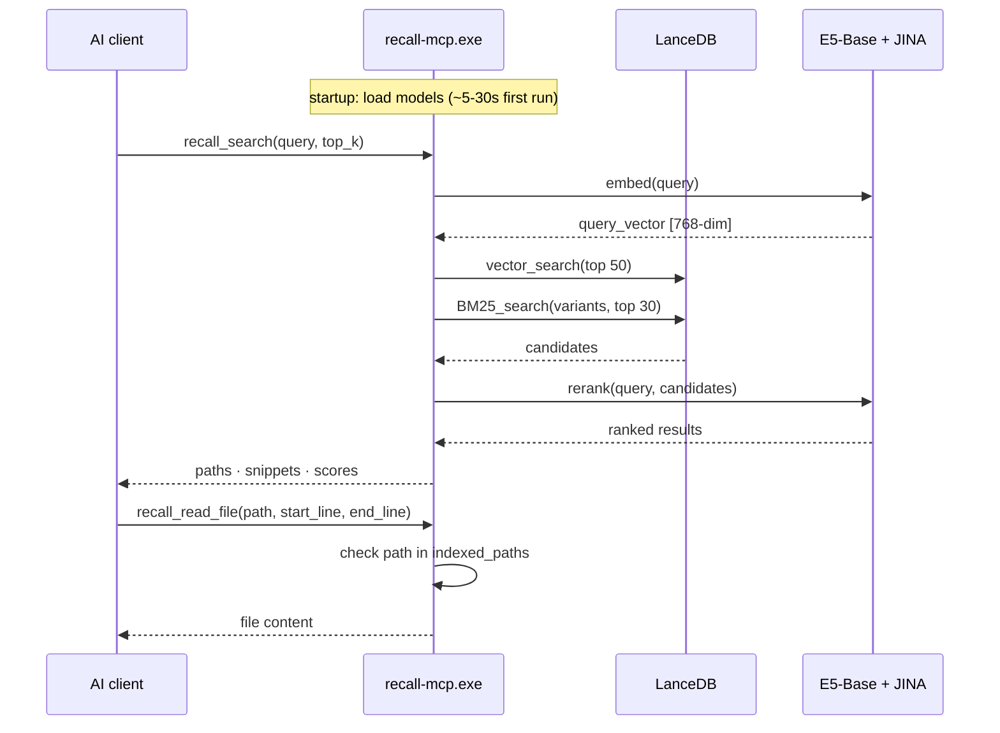

# MCP Server

`recall-mcp.exe` exposes your local index to any MCP-compatible AI client over stdio. No network. No API key. No extension to install in the client.

Index your files in the main app once. Then every AI client you connect gets semantic search, file reading, structure browsing, and diff detection on your local codebase.

---

## How it works



The MCP server and the GUI share the same LanceDB database and model cache. You do not need to re-index for the MCP server to see results.

---

## Get the binary

Download `recall-mcp.exe` from [releases](https://github.com/FeelTheFonk/recall-lite/releases).

Or build it yourself:

```bash
cd recall-lite/src-tauri
cargo build --bin recall-mcp --release
# Output: target/release/recall-mcp.exe
```

> [!IMPORTANT]
> Index at least one folder in the main GUI app before using the MCP server. The server does not index anything -- it only searches. No index = no results.

---

## Setup

### Cursor

Edit `~/.cursor/mcp.json` (or Settings > MCP > Add server):

```json
{
  "mcpServers": {
    "recall-lite": {
      "command": "C:\\Users\\YOU\\recall-mcp.exe"
    }
  }
}
```

### Claude Desktop

Edit `%AppData%\Claude\claude_desktop_config.json`:

```json
{
  "mcpServers": {
    "recall-lite": {
      "command": "C:\\Users\\YOU\\recall-mcp.exe"
    }
  }
}
```

### VS Code / GitHub Copilot

`.vscode/mcp.json` in your workspace, or user settings:

```json
{
  "mcp": {
    "servers": {
      "recall-lite": {
        "command": "C:\\Users\\YOU\\recall-mcp.exe"
      }
    }
  }
}
```

### Any other MCP client

Stdio transport. Absolute path to the exe. No arguments. No environment variables. No ports.

---

## Tools

### `recall_search`

Full hybrid pipeline: vector search + BM25 FTS + JINA reranker. Same quality as the GUI.

| Parameter | Type | Default | Description |
|---|---|---|---|
| `query` | `string` | required | Natural language or keyword query |
| `container` | `string?` | active | Which container to search |
| `top_k` | `number?` | 10 | Results to return (max 50) |
| `file_extensions` | `string[]?` | all | Filter by extension, e.g. `["rs", "ts"]` |
| `path_prefix` | `string?` | none | Filter by path prefix, e.g. `"src/indexer"` |
| `context_bytes` | `number?` | 1500 | Snippet size in bytes (max 10000) |

Returns: array of `{ path, snippet, score }` ordered by relevance.

---

### `recall_read_file`

Read a file without leaving MCP. Security: only reads files inside indexed container paths.

| Parameter | Type | Default | Description |
|---|---|---|---|
| `path` | `string` | required | Absolute path to the file |
| `start_line` | `number?` | 1 | Start line, 1-indexed, inclusive |
| `end_line` | `number?` | EOF | End line, 1-indexed, inclusive |

Typical pattern: `recall_search` to find a file, then `recall_read_file` to read it. One conversation, no round-trips.

---

### `recall_list_files`

Browse the indexed file tree. Useful for project structure discovery at the start of a session.

| Parameter | Type | Default | Description |
|---|---|---|---|
| `container` | `string?` | active | Which container |
| `path_prefix` | `string?` | none | Limit to a subdirectory |
| `extensions` | `string[]?` | all | Filter by extension |

Returns: deduplicated file list with sizes.

---

### `recall_index_status`

Check index health before searching. Agents should call this at session start.

| Parameter | Type | Default | Description |
|---|---|---|---|
| `container` | `string?` | active | Which container |

Returns: `total_files`, `total_chunks`, `has_index`, `indexed_paths`, container description.

---

### `recall_diff`

What changed recently? Call this at the start of a session to get instant context on recent work.

| Parameter | Type | Default | Description |
|---|---|---|---|
| `since` | `string` | required | Time window: `"30m"`, `"2h"`, `"1d"`, `"7d"` |
| `container` | `string?` | active | Which container |
| `show_diff` | `bool?` | true | Include first 50 lines of each changed file |

Returns: changed file paths, timestamps, previews, deleted file detection.

---

### `recall_related`

Given a file, find semantically similar files via vector proximity. Not grep, not imports -- actual meaning similarity in embedding space.

| Parameter | Type | Default | Description |
|---|---|---|---|
| `path` | `string` | required | Absolute path to the source file |
| `container` | `string?` | active | Which container |
| `top_k` | `number?` | 10 | Related files to return (max 30) |

Returns: related file paths with similarity scores and snippets.

---

### `recall_list_containers`

List all containers with their names, descriptions, indexed paths, and which one is active. No parameters.

---

## Startup time

First launch: 5-30 seconds. The server loads ~1.1 GB of E5-Base weights and ~1 GB of JINA Reranker weights. After that, queries are fast (< 1 s for most searches).

The weights are shared with the GUI process via the same model cache directory. If the GUI has already loaded them, the MCP server benefits from OS file cache.

---

## Troubleshooting

| Symptom | Cause | Fix |
|---|---|---|
| No results | Nothing indexed | Open the main app, index a folder, retry |
| Slow first query | Model loading | Wait ~30 s, subsequent queries are fast |
| Server not appearing in client | Wrong exe path | Use absolute path with double backslashes on Windows |
| Searching wrong container | Default is the active container | Pass `container: "Name"` explicitly |
| `recall_read_file` access denied | File not in any indexed path | Index the parent folder first |
| `recall_diff` returns nothing | Index is stale (app was closed during edits) | Open the main app, let the file watcher catch up |
| `recall_related` file not found | File not indexed | Index first, then search |

---

## Privacy

Everything is local. The MCP server reads the same local LanceDB and local ONNX models as the GUI. It communicates with AI clients over stdio, not network. Your file contents never leave your machine.
