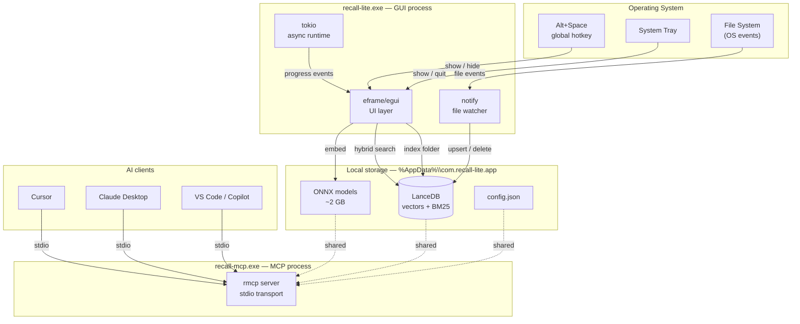
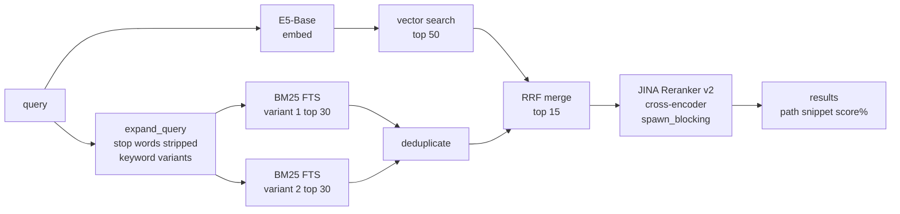
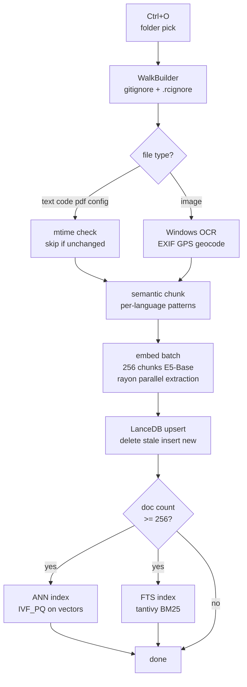
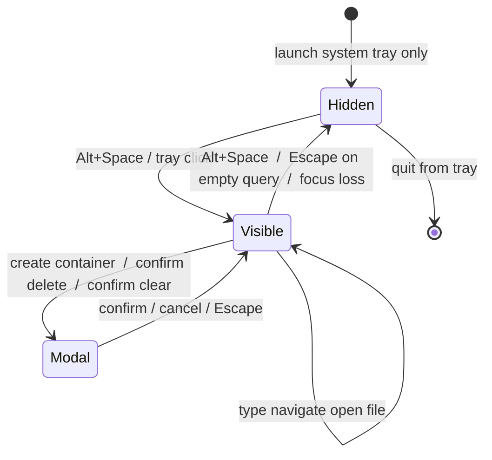

# Recall Lite

[](https://github.com/FeelTheFonk/recall-lite/actions/workflows/release.yml)
[](https://github.com/FeelTheFonk/recall-lite/releases/latest)
[](LICENSE)
[](https://github.com/FeelTheFonk/recall-lite)
[](https://www.rust-lang.org)

Local semantic file search for Windows 11. Spotlight-style overlay, hybrid vector + full-text search, offline AI embeddings, MCP server for AI agents. Nothing leaves your machine.

> Forked from [illegal-instruction-co/recall-lite](https://github.com/illegal-instruction-co/recall-lite).
> v2.0 rewrites the entire UI in native Rust (eframe/egui), removing the Tauri + React stack.

---

## Architecture



---

## What it does

- **Hybrid search** -- vector similarity (Multilingual-E5-Base, 768-dim) + BM25 full-text + JINA cross-encoder reranker. Finds what you mean, not just what you typed.
- **Spotlight overlay** -- global hotkey, no taskbar entry, hides on focus loss. Stays out of the way.
- **Windows 11 Mica** -- native blur / transparency through `window-vibrancy`. Looks right at home.
- **OCR on images** -- Windows built-in OCR engine. No external dependency. PNG, JPG, TIFF, BMP, WEBP.
- **EXIF metadata** -- camera, lens, aperture, ISO, focal length. GPS reverse-geocoded to city names offline. Dates expanded to day names, months, time of day, season in both English and Turkish. Search "photos from Istanbul" or "summer morning" and it works.
- **Semantic containers** -- isolate work / personal / research. Each container is a separate LanceDB table. Delete one, no orphaned vectors.
- **File watcher** -- OS-level events via `notify`, 500 ms debounce. Auto re-indexes changed files, removes deleted ones. Zero CPU at idle.
- **MCP server** -- `recall-mcp.exe` exposes your indexed files to AI clients over stdio. 7 tools, no network, no API keys.
- **50+ file types** -- code, docs, config, data, web, devops, images. Full list in [CONFIG.md](CONFIG.md).
- **Smart chunking** -- language-aware: Rust at `fn`/`struct`, Python at `def`/`class`, Markdown at headers, YAML at top-level keys.
- **Incremental indexing** -- mtime check per file. Only re-embeds what changed.
- **i18n** -- English and Turkish built-in. Auto-detects system language. Toggle in one click from the sidebar.

---

## Search pipeline



---

## Indexing pipeline



---

## Window behavior



> [!NOTE]
> The window hides when it loses OS focus (300 ms debounce after show). After a native folder-picker dialog, a 500 ms suppression window prevents the window from hiding before focus returns.

---

## Installation

No npm. No Node. No Tauri CLI. Pure Rust.

### Releases (Windows x64)

Download `recall-lite.exe` and `recall-mcp.exe` from [releases](https://github.com/FeelTheFonk/recall-lite/releases).

On first launch, ~2 GB of ONNX model weights download automatically into `%AppData%\com.recall-lite.app\models`. This is a one-time operation.

### Build from source

```bash
# Prerequisites: Rust stable (MSVC toolchain) + protoc
winget install Google.Protobuf

git clone https://github.com/FeelTheFonk/recall-lite
cd recall-lite/src-tauri

cargo build --release                       # GUI binary
cargo build --bin recall-mcp --release      # MCP server binary

# Output:
#   target/release/recall-lite.exe
#   target/release/recall-mcp.exe
```

> [!IMPORTANT]
> `protoc` is required at **build time** only (LanceDB dependency). Not needed at runtime.

> [!TIP]
> Release builds use `opt-level = 3`, LTO, and `mimalloc`. Debug builds are 10x slower -- always benchmark with `--release`.

---

## Quick start

1. Launch `recall-lite.exe`. It hides to the system tray immediately.
2. Press `Alt+Space` to open the overlay.
3. Press `Ctrl+O` to pick a folder to index. Wait for completion.
4. Type to search. Results appear after 300 ms idle.
5. `Enter` to open the selected file. `Escape` to hide.

The first launch is slow (~5-30 s) because the embedding model loads ~1.1 GB of weights. Subsequent launches are instant.

---

## Keyboard shortcuts

| Shortcut | Action |
|---|---|
| `Alt+Space` | Toggle overlay (global, works from any app) |
| `Ctrl+O` | Pick a folder to index |
| `Up` / `Down` | Navigate results |
| `Enter` | Open selected file |
| `Escape` | Clear query (if non-empty) -- hide window (if empty) |

The global hotkey is configurable. See [CONFIG.md](CONFIG.md).

---

## MCP server

`recall-mcp.exe` gives any MCP-compatible AI client direct access to your local index over stdio. No network. No API key. No extension to install.

7 tools: `recall_search`, `recall_read_file`, `recall_list_files`, `recall_index_status`, `recall_diff`, `recall_related`, `recall_list_containers`.

Full setup for Cursor, Claude Desktop, VS Code: [MCP.md](MCP.md)

---

## Configuration

`%AppData%\com.recall-lite.app\config.json` -- hand-editable JSON. Auto-migrated on parse failure.

Covers: embedding model, hotkey, launch at startup, always-on-top, indexing settings (extra / excluded extensions, chunk size, chunk overlap), containers, .rcignore.

Full reference: [CONFIG.md](CONFIG.md)

---

## Stack

| Layer | Technology |
|---|---|
| UI | [eframe 0.33](https://github.com/emilk/egui) + egui (wgpu backend) |
| Window effects | [window-vibrancy 0.7](https://github.com/tauri-apps/window-vibrancy) (Mica) |
| Global hotkey | [global-hotkey 0.7](https://github.com/tauri-apps/global-hotkey) |
| System tray | [tray-icon 0.21](https://github.com/tauri-apps/tray-icon) |
| Vector DB | [LanceDB 0.26](https://lancedb.com/) -- in-process, no server |
| Embeddings | [fastembed 5](https://github.com/Anush008/fastembed-rs) -- Multilingual-E5-Base (768-dim) |
| Reranker | fastembed -- JINA Reranker v2 Base Multilingual |
| Async runtime | tokio multi-thread |
| Parallel extraction | rayon |
| File watching | notify-debouncer-full |
| File traversal | ignore crate (ripgrep engine) |
| OCR | Windows.Media.Ocr (WinRT) -- zero install |
| GPS geocoding | reverse_geocoder -- offline kd-tree |
| MCP protocol | [rmcp 0.15](https://github.com/modelcontextprotocol/rust-sdk) |
| Allocator | mimalloc |

---

## Roadmap

See [ROADMAP.md](ROADMAP.md).

---

## Credits

Forked from [illegal-instruction-co/recall-lite](https://github.com/illegal-instruction-co/recall-lite) by [machinetherapist](https://github.com/illegal-instruction-co).

The core search engine -- LanceDB integration, fastembed pipeline, hybrid search, MCP server, file watcher, semantic chunking, EXIF/OCR pipeline, query expansion, incremental indexing -- is their work.

v2.0 contribution (this fork): full rewrite of the UI layer from Tauri + React to native Rust (eframe/egui), Spotlight window behavior with hide-on-unfocus, Windows 11 Mica transparency via wgpu, runtime i18n (EN + TR), multiple correctness fixes (GPS denom guard, ANN threshold, modal placeholder substitution, conditional focus, delete-without-dim).

---

## License

MIT.
